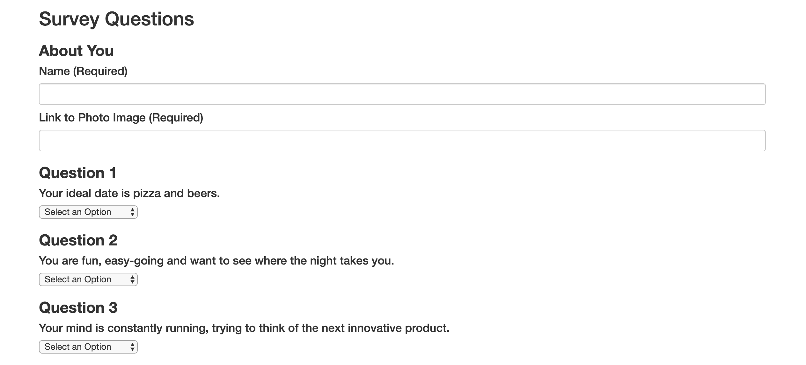

# FriendFinder

<h4>The Friend Finder app is very similar to a dating app. The application utilizes Node and Express in order to help you find the most compatible friend. </h4>

<ul> 

<li> The main purpose of the application is to take in the input values chosen for each question and push them to the friends data. Once the data is logged, math will be done in order to provide the most compatible user. </li> </ul>  

 
 

<a href="https://shielded-eyrie-59960.herokuapp.com/"> Heroku App Link </a>

 

<footer> This assignment was created by Elizabeth Bodzy for SMU Coding Bootcamp </footer>

